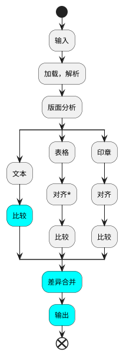

```plantuml
@startuml
start
:输入;
:加载，解析;
:版面分析;
split
:文本;
#00FFFF:比较;
split again
:表格;
:对齐*;
:比较;
split again
:印章;
:对齐;
:比较;
end split
#00FFFF:差异合并;
#00FFFF:输出;
end
@enduml
```

```plantuml
start
:输入;
:加载，解析;
:版面分析;
:对齐，分块;
split
:比较;
split again
:比较;
split again
:比较;
split again
:...;
end split
:差异合并;
:输出;
end
@enduml
```